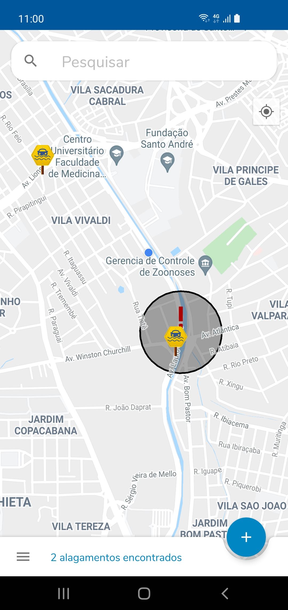
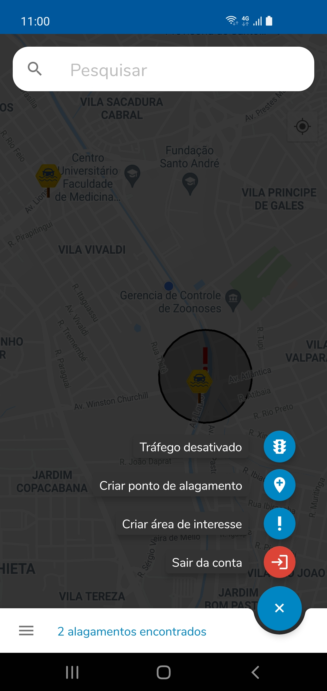

# Alagou! - Colaborative Android Flood Tracker

Alagou! - Real-time crowd-sourced Android app for monitoring and alerting floods.

## Features

- Watch real time floods alerts
- Report floods to alert others
- Register Points of Interest, like your home or work for ease of searching
- Searchbar with autocomplete location suggestions
- Login with your Google Account to sync

## Using

  - Kotlin
  - MVVM Pattern
  - Android Architecture Components (LiveData, Room, ViewModel)
  - RecyclerView
  - Retrofit
  - Gson
  - Moshi
  -  [Alagou! - Node.js Backend](https://github.com/fernandesleite/alagou-backend)
  
## Demo

## Screenshots

       
